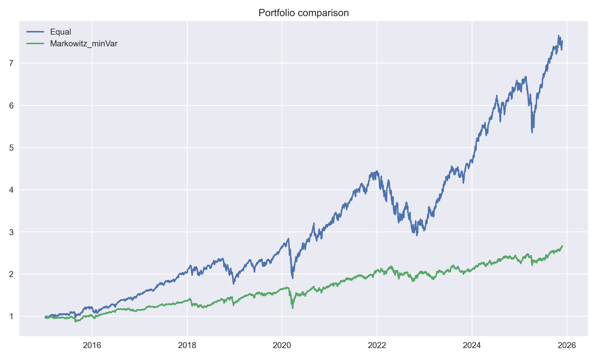

# Portfolio Optimization Lab

This project explores a few foundational techniques in portfolio construction using Python.  
The goal was to build a small but coherent workflow for handling market data, estimating return and risk metrics, and applying classic allocation methods used in quantitative finance.

The focus is on clarity and fundamental concepts rather than complexity.

---

## Overview

The analysis is based on a set of large-cap US equities.  
After downloading and cleaning price data from Yahoo Finance, the notebook computes daily log-returns, estimates annualized means and covariances, and constructs three portfolios:

- **Equal-Weight Portfolio**  
- **Minimum-Variance (Markowitz) Portfolio** with long-only, fully invested constraints  
- **Black–Litterman Expected Returns (Basic Version)** to illustrate how subjective views can adjust historical estimates  

The methods are implemented manually using `numpy`, `pandas`, and `scipy.optimize`, without relying on external optimization libraries.  
This was intentional to understand the mechanics of the models.

---

## Equity Curve

The chart below compares the in-sample evolution of the Equal-Weight and Minimum-Variance portfolios:

---

## Methods

### 1. Return and Covariance Estimation
- Log-returns computed from adjusted close prices  
- Annualization using 252 trading days  
- Sample mean vector and covariance matrix used as inputs to the optimization models  

### 2. Equal-Weight Benchmark
A simple baseline allocating capital uniformly across all assets.

### 3. Minimum-Variance Portfolio
A standard Markowitz optimization solved with `scipy.optimize.minimize` under:
- long-only weights  
- weights summing to 1  

The objective minimizes portfolio variance subject to these constraints.

### 4. Black–Litterman (Basic Implementation)
A minimal version of the Black–Litterman model is included to adjust expected returns.  
One illustrative view is added (e.g., a slight positive tilt on Apple relative to the market portfolio).  
The aim is conceptual understanding rather than a full production model.

---

## Technologies

- Python  
- pandas, numpy  
- yfinance for historical data  
- scipy for optimization  
- matplotlib for visualization  

---

## How to Run

1. Open the notebook in JupyterLab  
2. Run the cells from top to bottom  
3. The equity curve image (`equity_curve.png`) is generated automatically  

---

## Possible Extensions

If extended in the future, natural next steps include:
- Sharpe-ratio maximization  
- Out-of-sample evaluation  
- Regularized covariance estimators  
- Full Black–Litterman with multiple views and market-cap prior  

---

## Purpose

The project was designed as a hands-on introduction to quantitative portfolio construction.  
It demonstrates understanding of the mathematical structure behind Markowitz optimization, numerical optimization workflows, and how expected returns can be adjusted using the Black–Litterman framework.
